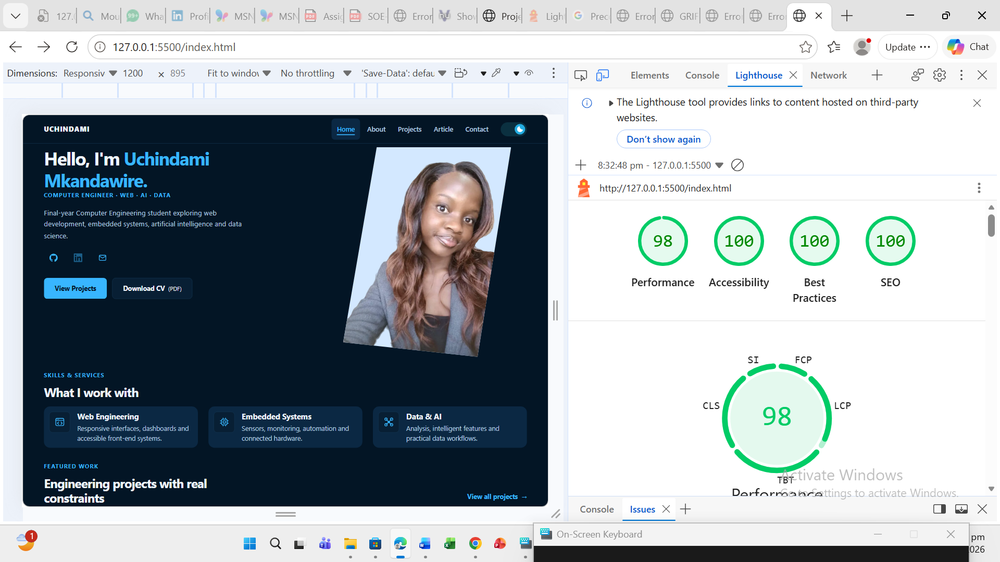

# Uchindami Mkandawire — Engineering Portfolio

This is my completed personal portfolio for the Internet and Web Services assignment at MUBAS. It brings together my background, technical skills, engineering projects and an article on artificial intelligence in embedded systems.

The site is built with HTML, CSS and JavaScript and is deployed on GitHub Pages. No framework, package installation or build step is required.

## Links

- [Live website](https://Student-Work-Classroom-Demo-MUBAS.github.io/personal-portfolio-assignment/)
- [Repository](https://github.com/Student-Work-Classroom-Demo-MUBAS/personal-portfolio-assignment)
- [Download my CV](assets/documents/uchindami-mkandawire-cv.pdf)

## Homepage preview



## Pages

- [Home](index.html): introduction, featured projects and contact section.
- [About](about.html): background, technical skills and CV download.
- [Projects](projects.html): category filters, project links and recent public GitHub repositories.
- [Article](article.html): artificial intelligence in embedded systems.
- [Custom 404](404.html): a recovery page with links back to Home and Projects.

The portfolio includes five project pages:

- [GRIFFIN fuel monitoring system](griffin.html)
- [Smart Irrigation](smart-irrigation.html)
- [Smart House](smart-house.html)
- [Home Network Design and Configuration](networking.html)
- [Library Management System](library-management.html)

## Features

- Responsive layouts for mobile, tablet and desktop screens.
- Light and dark themes with saved preferences.
- Mobile navigation and project category filters.
- GitHub API integration with loading, error and retry states.
- Contact-form validation with inline error messages.
- Keyboard navigation, skip links, visible focus and reduced-motion support.
- Downloadable CV and optimised WebP project images.

The contact form validates input but does not send messages. Visitors can contact me through the email link provided on the site.

## Running the site locally

The `main` branch contains the website and its documentation.

Open the project folder in VS Code and use Live Server, or run the following command from the project folder if Python is installed:

```sh
python -m http.server 8000
```

Then visit `http://localhost:8000/index.html`. The GitHub feed and the About page's technology icons need an internet connection.

The custom 404 page uses GitHub Pages project paths for its recovery links and script. Test the deployed fallback using an invalid URL under the repository's website address; Python's standard server does not automatically serve the custom page for missing URLs.

## File organisation

- Root HTML files: main pages and individual project pages.
- `style.css`: shared styles, themes and responsive layouts.
- `script.js`: navigation, theme switching, form validation, article navigation, project filtering and the GitHub feed.
- `assets/images/`: portfolio images, project screenshots and testing evidence.
- `assets/icons/`: social icons.
- `assets/documents/`: downloadable CV.
- `docs/`: design notes, decisions, AI-use disclosure and testing records.

Project images use WebP to reduce file size. The Cisco and Griffin screenshots were converted losslessly, and the Smart House image was converted at quality 80 using Google's `cwebp` tool.

## Testing

The [testing checklist](docs/testing-checklist.md) records HTML validation, responsive checks, JavaScript functionality, GitHub API behaviour, keyboard accessibility, colour contrast and reduced-motion testing, with supporting screenshots.

The recorded local homepage Lighthouse results are:

| Category | Score |
| --- | ---: |
| Performance | 98 |
| Accessibility | 100 |
| Best Practices | 100 |
| SEO | 100 |

These scores describe the saved local audit; deployed results may differ.

## Credits and AI use

The About page uses Devicon technology icons. The font stack uses Segoe UI, Arial and sans-serif. Google's `cwebp` tool was used for selected image conversions.

AI assistance and my responsibility for the submitted work are described in the [AI-use disclosure](docs/ai-use.md).

## Project notes

- [Design notes](docs/design-notes.md)
- [Decision log](docs/decision-log.md)
- [AI-use disclosure](docs/ai-use.md)
- [Testing checklist](docs/testing-checklist.md)
