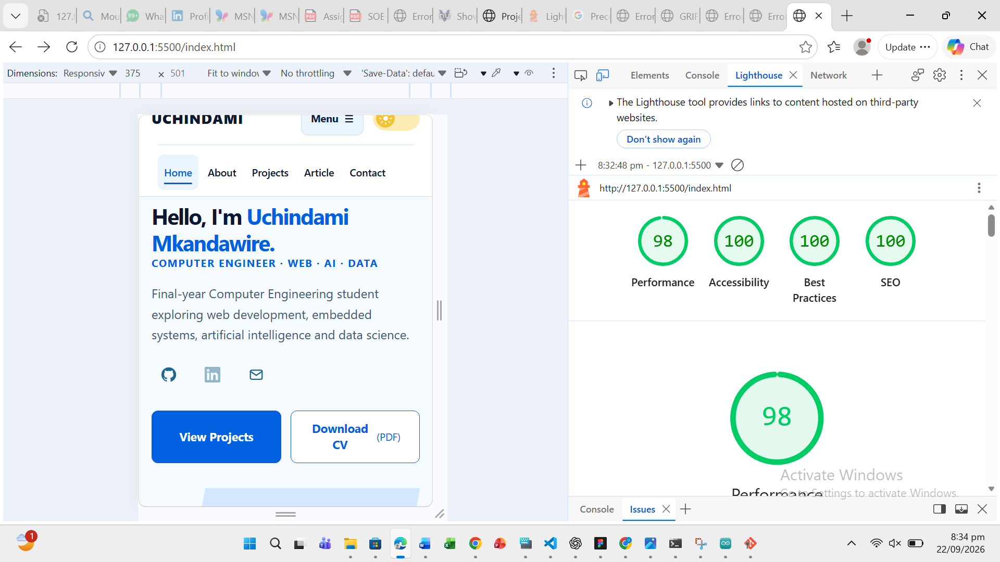

# Testing

The portfolio website was tested against the main technical requirements of the assignment. Testing focused on HTML validation, responsive behaviour, JavaScript functionality, accessibility and performance.

## W3C HTML Validation

The HTML pages were checked using the W3C Markup Validation Service.

Initial validation identified ARIA issues on some project pages, including `aria-label` attributes being used on elements without an appropriate semantic role. These were corrected and the affected pages were checked again.

| Test | Result | Notes |
| --- | --- | --- |
| HTML validation | Pass | W3C validation completed and identified errors were corrected |
| Project pages | Pass | ARIA and section-related validation issues were corrected |
| Final validation check | Pass | No remaining HTML errors requiring correction |

## Responsive Design Testing

The website was tested at the main responsive breakpoints used in the stylesheet.

| Width | Layout | Result |
| ---: | --- | --- |
| `550px` | Mobile | Pass |
| `768px` | Tablet | Pass |
| `1024px` | Desktop | Pass |
| `1200px` | Large desktop | Pass |

The following were checked at each size:

- Navigation remained usable.
- Text did not overlap or become clipped.
- Project cards and skill sections adjusted correctly.
- Portrait images remained correctly positioned and cropped.
- Images maintained their proportions.
- The contact form remained usable.
- No unwanted horizontal page scrolling was found.

### Responsive Testing Evidence

Desktop layout at 1200px, showing the navigation, hero content and contained portrait.

## JavaScript Testing

The main interactive features were tested manually in the browser.

| Test | Result | Notes |
| --- | --- | --- |
| Light/dark theme toggle | Pass | Theme changed correctly |
| Theme persistence | Pass | Selected theme remained after page reload |
| Mobile navigation | Pass | Menu opened and closed correctly |
| Contact-form validation | Pass | Custom error messages appeared for invalid input |
| Project filters | Pass | Correct projects were displayed for each category |
| GitHub API | Pass | Public repository data loaded successfully |
| API loading state | Pass | Loading state appeared while data was being retrieved |
| API failure handling | Pass | Error handling worked when the browser was placed offline |
| Retry behaviour | Pass | API request could be attempted again after reconnecting |
| Browser console | Pass | No JavaScript errors or warnings remained during testing |

Invalid input produces inline messages; the focused Subject field has a visible outline.

The offline test was used to test API failure handling. It was not used as the custom 404 test because an offline browser cannot reach the web server.

## Accessibility Testing

The website was tested manually for keyboard accessibility, focus visibility and colour contrast.

| Test | Result | Notes |
| --- | --- | --- |
| Keyboard navigation | Pass | Interactive elements could be reached without using a mouse |
| Visible focus | Pass | Focus state remained visible while navigating |
| Skip link | Pass | Skip link moved focus to the main page content |
| Navigation controls | Pass | Navigation and interactive controls were keyboard accessible |
| Form accessibility | Pass | Form fields and validation messages remained usable by keyboard |
| Light-theme contrast | Pass | Text remained readable against the light background |
| Dark-theme contrast | Pass | Text remained readable against the dark background |
| Reduced motion | Pass | Reduced-motion preference was respected |

The screenshot below shows a contrast ratio of `8.17:1` for the blue introductory label against the dark background. This exceeds the WCAG AA requirement of `4.5:1` for normal body text.

## Lighthouse Testing

The saved Lighthouse report for the local homepage (`http://127.0.0.1:5500/index.html`) shows the scores below. The screenshot also shows a 375px responsive viewport; the audit mode is not visible.

| Category | Required Target | Result | Score |
| --- | ---: | --- | ---: |
| Performance | 85+ | Pass | 98 |
| Accessibility | 90+ | Pass | 100 |
| Best Practices | 90+ | Pass | 100 |
| SEO | 90+ | Pass | 100 |

### Lighthouse Evidence

## Custom 404 Page

The custom `404.html` page exists and is ready for deployment testing.

The 404 page cannot be correctly tested by setting the browser to offline mode because this produces the browser's own `ERR_INTERNET_DISCONNECTED` page before the server can respond.

| Test | Result | Notes |
| --- | --- | --- |
| `404.html` exists | Pass | Custom page included in the project |
| Invalid deployed URL | Pending | To be tested after deployment |

After deployment, a deliberately invalid URL will be opened while connected to the internet to confirm that the custom 404 page is returned.

## Test Summary

| Test Area | Result |
| --- | --- |
| W3C HTML validation | Pass |
| Responsive design | Pass |
| JavaScript functionality | Pass |
| GitHub API | Pass |
| Keyboard accessibility | Pass |
| Colour contrast | Pass |
| Reduced motion | Pass |
| Browser console | Pass |
| Lighthouse | Pass |
| Custom 404 on deployed site | Pending |

The main functionality and technical requirements of the portfolio passed testing. The remaining test is the custom 404 response on the deployed website.